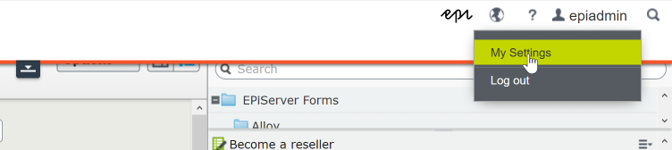
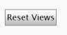
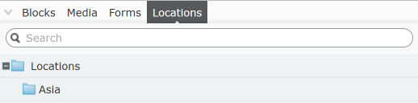

# External Content Replication - Lab Guide

### Tasks

1. [Creating the content type](#1-creating-the-content-type)
2. [Root Initialization](#2-root-initialization)
3. [Creating the Content Repository Descriptor](#3-creating-the-content-repository-descriptor)
4. [Creating the UI Component Definition](#4-creating-the-ui-component-definition)
5. [Building and Running](#5-building-and-running)

### Bonus Tasks

6. [Importing some content](#6-importing-some-content)
7. [Wiring up search](#7-wiring-up-search)

The aim of this session is to show you one approach to persisting external data in the Episerver content model. As mentioned in the introduction, replicating content in Episerver comes with some inherent advantages, including performance (taking advantage of out-of-the-box catching etc.) and robustness.

This guide will take you through the essential components required to get this working, including creating a content type, initializing the content root for out external content, creating a content descriptor and registering the UI component. At this point, we should be able to run the solution and create, edit and delete content of our content type in the Episerver CMS.

On top of this, this guide contains a few additional exercises you can attempt if you have the time, namely, enabling searching in the UI component (with Episerver Find) and showing how content can be imported and created using the content repository.

## 1. Creating the content type

Not all content in Episerver has to be persisted as a page or block type. In fact, often when working with external content, these types are not a good fit for the data you need to store. Take for example storing a location; this is not necessarily well represented by a page or block, and in fact is likely better characterized by a more generic content type. This allows editors to interact with it as if it was any other content (dragging-and-dropping, previewing, using display options etc.) whilst allowing more control and configurability in code. 

Episerver provides abstract classes precisely for this scenario, these are: 

| Class Name          | Description                                                                                                                         |
| ------------------- | ----------------------------------------------------------------------------------------------------------------------------------- |
| BasicContent        | A very basic implementation of IContent.                                                                                            |
| ContentBase         | Inherits from BasicContent, adds implementations of some common Episerver interfaces including IVersionable and IModifiedTrackable. |
| StandardContentBase | Inherits from ContentBase but implements even more Episerver interfaces—most significantly ILocalizable.                            |

Additional interfaces can be added as required (e.g. IRoutable) which allows for a lot of flexibility  from a developer perspective, in that it also only necessary to implement interfaces you require.

For **task 1**:

1. Locate the 'LocationContent' class (AlloyDemoKit\Locations)
2. Update it to inherit from StandardContentBase
> 💡 Alternatively, if you're feeling risky, use one of the other base types documented above.  
3. Add a `ContentTypeAttribute`, set a DisplayName and assign it a unique GUID.

<details>
<summary>Just let me see the code!</summary>

```c#
[ContentType(
    DisplayName = "Location",
    GUID = "870FC2A1-CF1F-4953-93AD-973A9C637F76")]
public class LocationContent : StandardContentBase
{
    // Properties here
}
```

</details>

## 2. Root Initialization

Our next task is providing a location for our new content to live under. Like task 1, this enables us to keep our external content separate and avoid forcing it under the page or block roots. This enables us to maintain a clear distinction between our imported/external content and all our standard editor created content.

For **task 2**:
1. Locate the `LocationRootInitialization` class (AlloyDemoKit.Locations)
> 💡 This is just a standard initialization module, although an instance of the `ContentRootService` has been resolved via the service locator.
2. Use the ContentRootService Register method to register a ContentFolder (`EPiServer.Core`) as the root.
    * The rootName should be "Locations"
    * Assign it a freshly generated GUID
    * Set the parent to the root page (available via `EPiServer.Core.ContentReference.RootPage`)

<details>
<summary>Just let me see the code!</summary>

```c#
public void Initialize(InitializationEngine context)
{
    var contentRootService = context.Locate.Advanced.GetInstance<ContentRootService>();

    contentRootService.Register<ContentFolder>("Locations", new Guid("3A596E25-4B13-41D6-9958-C21D38B71A09"),
        EPiServer.Core.ContentReference.RootPage);
}
```

</details>

## 3. Creating the Content Repository Descriptor

The content repository descriptor _literally_ describes the repository and allows the UI to be auto-generated. It defines virtually all aspects of our location content repository including: what root should be used, contained content types, creatable content types and linkable content types.

It allows a lot of configuration but here we’ll go through getting a basic repository descriptor to work.

For **task 3**:
1. Find the `LocationContentRepositoryDescriptor` class (AlloyDemoKit\Locations)
> 💡 This inherits `ContentRepositoryDescriptorBase` and is registered as a service using the `ServiceConfigurationAttribute`. Note: that it also resolves the root we registered in task 2 in the constructor.
2. Override the `Key` property, set it to "locations"
3. Override the `Name` property, set it to "Locations"
4. Override the `Roots` property, the getter should return the ContentReference _root in an array or list of ContentReferences.
> 💡 This will ensure that our content repository uses the root registered in task 2.
5. Override the `ContainedTypes`, the getter should return an array of types which should be our `LocationContent` type and `ContentFolder` type. This should look like:
    ```c#
    new[] {typeof(x), typeof(y)}
    ```
> 💡 At this point you have overridden all the requisite 'ContentRepositoryDescriptor' properties
6. Add a `CreatableTypes` override (this should look exactly `ContainedTypes` one), the getter should return an array of types which should be our `LocationContent` type and `ContentFolder` type. 
7. Add a `LinkableTypes` override (this should look exactly `ContainedTypes` one). Let’s restrict this to only the `LocationContent`.
8. Add a `MainNavigationTypes` override (this should look exactly `ContainedTypes` one). This should only be the `ContentFolder` type.

<details>
<summary>Just let me see the code!</summary>

```c#
[ServiceConfiguration(typeof(IContentRepositoryDescriptor))]
public class LocationContentRepositoryDescriptor : ContentRepositoryDescriptorBase
{
    private readonly ContentReference _root;

    public LocationContentRepositoryDescriptor(ContentRootService contentRootService)
    {
        _root = contentRootService.Get("Locations");
    }

    public override string Key => "locations";
    public override string Name => "Locations";
    public override IEnumerable<ContentReference> Roots => new[] { _root };
    public override IEnumerable<Type> ContainedTypes => new[] { typeof(LocationContent), typeof(ContentFolder) };

    public override IEnumerable<Type> CreatableTypes => new[] { typeof(LocationContent), typeof(ContentFolder) };
    public override IEnumerable<Type> LinkableTypes => new[] { typeof(LocationContent), };
    public override IEnumerable<Type> MainNavigationTypes => new[] { typeof(ContentFolder), };
}
```

</details>

## 4. Creating the UI Component Definition

This defines that actual component in the UI and where it will be positioned, it will reference our content repository descriptor from above and define the sort order, name (in the UI) and area of the component.

For **task 4**:

1. Find the `LocationTreeComponent` class (AlloyDemoKit\Locations)
> 💡 This inherits from `ComponentDefinitionBase` and sets the widget type to "epi-cms/asset/HierarchicalList". This avoids creating a custom Dojo widget just for the purposes of this demo.
2. In the constructor, set the `base.Title` to "Locations"
3. In the constructor, `Categories`  should be set to a string array containing only the string `"content"`;
4. In the constructor, PlugInAreas should be set to string array containing `"/episerver/cms/assets/defaultgroup"`
> 💡 This will make the component available in the assets pane.
There is constant with this value at EPiServer.Shell.PlugInArea.AssetsDefaultGroup
5. In the constructor, set the `SortOrder` to 1000 to place our component last in the assets pane.<br>
6. Finally, we need to add a setting to `base.Settings`. This should have the key "repositoryKey" and a value which matches the repository descriptor we created in step 2:<br>
    ```c#
    base.Settings.Add(new Setting("repositoryKey", "locations"));   ```
> 💡 This links together our UI component and the description (definition) of our repository, including the root and the creatable types etc.

> ⚠️ You probably notice that the constructor contains an additional setting called “noDataMessages”:<br>
`base.Settings.Add(new Setting("noDataMessages", new { single = "This folder does not contain any locations", multiple = "These folders do not contain any locations" }));`<br>
This is because the HierarchicalList Dojo widget is intended to be used as a base for other Dojo widgets. These values would normally be set in JS. However, to simplify things here and avoid creating a separate Dojo component, we set that in the component definition—this is a maybe little hacky, but it works.

## 5. Building and Running

At this point, build and run your solution! You can now navigate to the Episerver CMS and see our locations component—you should also be able to create, edit and delete locations!

For **task 5**:

1. Build and run the solution
2. Login (/episerver/cms)
    * Username: `epiadmin`
    * Password: `3p!Pass`
3. Navigate to the 'Locations' tab in the asset pane
4. Create a folder
5. Create some location content!

> ⚠️ If you don't see the locations tab, trying the following:
> 1. Select **My Settings** under **epiadmin** in the top right of the top menu.<br>

> 2. Click the **Display options** tab
> 3. Hit the **Reset views** button:<br>

---

# Bonus Tasks

## 6. Importing some content

We can now import some content into our solution. For the purposes of this lab, we’re going to use a scheduled job—however, as highlighted in the presentation this isn’t optimal and doesn’t support our real-time objectives. In reality, a recommendation would be to use something like the Azure Service Bus to get virtually really time updates and guarantee more robustness in the import process.

For **task 6**:

1. Find the `LocationImportScheduledJobclass` (AlloyDemoKit\Locations)
2. Uncomment the section denoted by the `TODO`, (lines 94-122)
3. Implement the `GetFolderBySegment` method, this utilitizes the Content Repository `GetBySegment` method, it _should_ look like this:
    ```c#
    return _contentRepository.GetBySegment(rootLink, _urlSegmentGenerator.Create(regionName), ContentLanguage.Instance.FinalFallbackCulture) as ContentFolder;
    ```
4. Start the solution & go and run the scheduled job!

> 💡 This only provides a **very** rough example of an implementation and by no means conforms with best practices! In a real-world example you like store the external ID as a property and use Episerver Find to look this up.

<details>
<summary>Just let me see the code!</summary>

All the code you needed was already above! 😉

```c#
private ContentFolder GetFolderBySegment(ContentReference rootLink, string regionName)
{
    return _contentRepository.GetBySegment(rootLink, _urlSegmentGenerator.Create(regionName), ContentLanguage.Instance.FinalFallbackCulture) as ContentFolder;
}
```

</details>

## 7. Wiring up search

You probably noticed that the UI already shows a search bar for Locations:



Currently this doesn’t work, therefore the purpose of this task is to wire it so editors can utilize the search function.

For **task 7**:

1. The Find index created when this repository was setup has now expired, you therefore need to update the `episerver.find` section in the `Web.config` (line 19). Update it to this:
    ```xml
    <episerver.find serviceUrl="https://es-eu-dev-api01.episerver.net/rlRU00mcD9MoJfKmHi9mO4iUC7pSRZUf/" defaultIndex="jakejones_epiascend"/>
    ```
2. Find the `LocationSearchProvider` (AlloyDemoKit\Locations)
3. Uncomment everything that is commented out
4. There are now a method and two properties you have to implement, these are as follows:
    * **IconCssClass** method<br>
    This simply returns the icon CSS class you want to use, for this example let’s just use the one for blocks:
        ```c#
        protected override string IconCssClass(LocationContent contentData)
        {
            return FindContentSearchProviderConstants.BlockIconCssClass;
        }
        ```
    * **Category** property (just a getter)<br>
    This is the category of your search provider, normally you’d localize this but for this lab just return “Locations”.
    * **Area** property (just a getter)<br>
    This is the important one, it is the area that the provider maps to and is used to associate the ContentRepositoryDescriptor with the SearchProvider. Let’s use `"CMS/Locations"`.
5. Finally, we need to go to our `LocationContentRepositoryDescriptor` (created above in task 3) and add a new string property called SearchArea property (this should be an override), also set this to `"CMS/Locations"`.
6. After runnning the indexing job in the admin section of the CMS you should now be able to search for locations!

<details>
<summary>Just let me see the code!</summary>

The search provider:

```c#
[SearchProvider]
public class LocationSearchProvider : EnterpriseContentSearchProviderBase<LocationContent, ContentType>
{
    public LocationSearchProvider(LocalizationService localizationService,
        ISiteDefinitionResolver siteDefinitionResolver, IContentTypeRepository blockTypeRepository,
        UIDescriptorRegistry uiDescriptorRegistry) : base(localizationService, siteDefinitionResolver,
        blockTypeRepository, uiDescriptorRegistry)
    {
    }

    protected override string IconCssClass(LocationContent contentData)
    {
        return FindContentSearchProviderConstants.BlockIconCssClass;
    }

    public override string Category => "Locations";

    public override string Area => "CMS/Locations";
}
```

The content repository descriptor:

```c#
[ServiceConfiguration(typeof(IContentRepositoryDescriptor))]
public class LocationContentRepositoryDescriptor : ContentRepositoryDescriptorBase
{
    /// All the other properties
    /// 
    public override string SearchArea => "CMS/Locations";
}
```

</details>